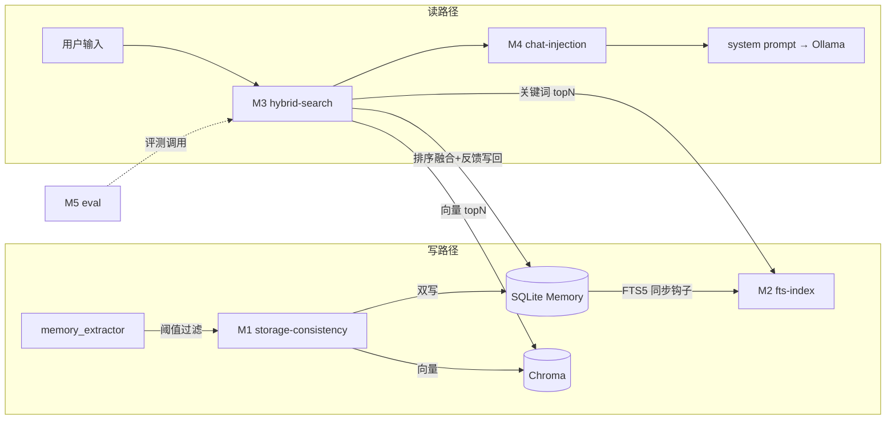

# memory-retrieval-opt 总体架构

状态: draft | 修订轮次: r1 | 日期: 2026-09-06

## 修订记录
| 版本 | 日期 | 变更 | 触发 |
|---|---|---|---|
| r1 | 2026-09-06 | 初稿 | - |

## 技术选型
| 项 | 选择 | 理由(一句话) |
|---|---|---|
| 嵌入模型 | bge-m3(Ollama) | 中文语义强、768维、Ollama 原生支持(决策 D-001) |
| 关键词通道 | SQLite FTS5(content=外部内容表, trigram 分词) | 零新依赖、随库落盘、中文子串匹配可用(D-002);Python 标准库 sqlite3 已带 FTS5,需验证 chromadb 无关 |
| 融合算法 | RRF(Reciprocal Rank Fusion, k=60) | 无参数、对两通道分数量纲不敏感,工业惯例 |
| 排序分 | final = α·sim + β·imp/10 + γ·decay + δ·access | 线性可解释、权重进 config(D-003),默认 α=0.7,β=0.15,γ=0.1,δ=0.05 |
| 时间衰减 | exp(-Δdays/τ), τ=90;从未访问记忆不施加访问惩罚 | 平滑、无断崖;避免冷启动饿死(R-4) |
| 评测 | pytest 外的独立脚本 scripts/eval_memory.py + JSON golden set | 与单测隔离、实机指标可复现(D-005) |
| 新依赖 | 无 | FTS5/RRF/衰减均标准库自实现 |

## 模块划分
| # | 模块 | 职责边界 | 依赖 | 文档路径 |
|---|---|---|---|---|
| M1 | storage-consistency | 嵌入模型默认值切换;SQLite↔Chroma 对账自愈;原子化重建(rebuild);create_memory 悬空 vector_id 修复;写入阈值收紧 | 无(底层) | design/modules/storage-consistency.md |
| M2 | fts-index | FTS5 影子表建表/迁移;记忆增删改同步;关键词检索接口(search → [(memory_id, rank_score)]) | 无(底层,读 Memory 表) | design/modules/fts-index.md |
| M3 | hybrid-search | 查询串构建(原文为主+keywords辅助);双通道召回+RRF+排序融合+访问反馈更新;阈值/截断后的 search_memories_v2 | M1, M2 | design/modules/hybrid-search.md |
| M4 | chat-injection | build_context 统一走 v2 检索;注入阈值/top_k 进 config;删除死代码 build_memory_context | M3 | design/modules/chat-injection.md |
| M5 | eval | golden set(≥30条,6类各≥4)+ 评测脚本,输出 hit@1/hit@3/无关节注入率 | M3(接口) | design/modules/eval.md |

## 依赖与数据流

无循环:M1/M2 平行底层,M3 依赖两者,M4/M5 只依赖 M3。FTS5 同步钩子挂在 M1 写路径内(由 M1 调 M2 接口),不构成反向依赖。

## 关键时序
1. **启动/切换嵌入模型**:startup 自检 → M1.reconcile():对比活跃记忆集与 Chroma+FJS 覆盖 → 缺则重嵌入补齐;失败逐条记日志不中断 → 若模型变更,设置页红字引导"重建向量库"(M1.rebuild 逐条重嵌入,单条失败不提交该条 vector_id 更新)。
2. **对话查记忆**:chat → M4 → M3.search:原文+keywords 组查询 → 向量 topN(n=10)+ FTS topN → RRF → final 分排序 → 阈值(0.35)截断 → top_k(5) → 更新 accessed_at/access_count(异步 fire-and-forget) → 注入 system。
3. **记忆写入**:后台提取 → M1:conf<0.6 或 imp<4 → 丢弃并记日志;否则查重(sim>0.85 更新) → SQLite 事务内:写 Memory + M2 FTS 同步 + Chroma 提交;Chroma 失败 → 回滚 vector_id 为 None(下次 reconcile 补偿)。
4. **评测**:eval 脚本装载 golden set → 逐条 M3.search(user=评测专用隔离 user) → 比对 memory_id 命中 → 输出 JSON 报告(改前/改后各跑)。

## 风险评估
| id | 描述 | 概率 | 影响 | 缓解措施 | 状态 |
|---|---|---|---|---|---|
| R-1 | 切换嵌入模型致维度变化,存量向量失效;重建失败留下半重建态(现状 9/24 缺口根因) | 中 | 高 | M1:单条原子(成功才落 vector_id)+ reconcile 自愈兜底 + rebuild 断点续跑 | open |
| R-2 | 相似度阈值过高误杀长尾查询,召回率反降 | 中 | 中 | 阈值进 config;评测集定参,先低(0.3)后调 | open |
| R-3 | 单测环境无 Ollama/嵌入服务 | 高 | 中 | 单测全 mock(沿用既有 conftest 约定);评测脚本实机单独跑 | open |
| R-4 | 访问反馈富者愈富,低频记忆饿死 | 中 | 低 | δ=0.05 权重小;衰减只作用时间不惩罚未访问 | open |
| R-5 | FTS5 trigram 对中文效果差或环境不含 FTS5 | 中 | 低 | 启动探测 FTS5 能力,缺失/效果差则关键词通道自动禁用退回纯向量 | open |
| R-6 | golden set 仅~30条,指标噪声大误导调参 | 中 | 中 | 只做相对对比;6类各≥4条;脚本报告保留逐条明细供人工复核 | open |

四类检查:技术(R-1,R-5) 依赖(R-3,零新依赖故低) 性能(R-2 误调、全量 rebuild 时长——本地 24→千级规模可接受) 安全(无新增面,本地单用户,golden set 不含敏感凭据——低)。

## 可观测性约定
- 错误信息 MUST 含:出错位置、关键入参(memory_id/query/模型名)、当前状态(Chroma count vs SQLite count)。
- 日志:沿用 utils/logger;新增 `[RECONCILE]` `[HYBRID]` `[FTS]` 前缀;M3 每次检索记 INFO:`通道命中数/RRF后top1/最终注入数`——评测与排障靠它。
- reconcile 结果暴露到 `/api/v1/memories/stats`(新增 drift/vector_missing 字段),前端设置页可见。

## 测试约定
- 框架:pytest(既有);命令:`cd backend && python -m pytest tests -q`
- 基线:每个模块对外接口全集 + AC-1/AC-2/AC-5 对应用例;mock 掉 embedding/Chroma 网络层与 Ollama;FTS5 用例用 SQLite 内存库真实执行(FTS5 属本地引擎非外部服务,不 mock)。
- 评测脚本(AC-3/AC-4)离线不可跑,豁免单测,计划在 plan 中声明。

## 不做清单
- 不做:向量库换引擎、LLM rerank(延迟×成本不划算)、会话级 summary 记忆、前端记忆可视化改造、多用户隔离逻辑重写(沿用 user_id 过滤)。
