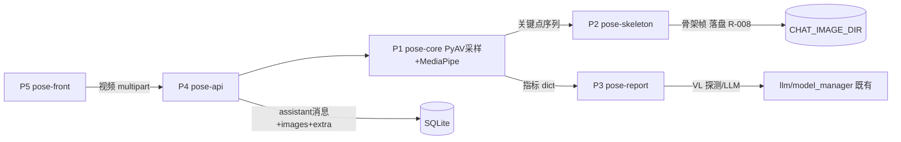

# sunchat 设计变更(R-017 跑步姿态分析)

需求: R-017 | 类型: iteration(feature on 既有基线) | 日期: 2026-09-13
基线: design/overview.md(memory-retrieval-opt r1)+ modules/chat-image.md(R-008)+ R-010 附录

状态: draft | 修订: r1

## 技术选型
| 项 | 选择 | 理由 |
|---|---|---|
| 姿态估计 | MediaPipe Pose(tasks API,pose_landmarker_lite 0.10.35 锁版) | 33 关键点 CPU 可用、离线;实测与 numpy 1.26.4 共存(冒烟 import+API 装载通过,2026-09-13)[RUN] |
| 模型文件 | pose_landmarker_lite.task(1.x)手工预置 `backend/data/pose-models/`,运行期禁下载 | 同 R-009 whisper 预置约定;缺失→端点 503 明确文案 |
| 解码采样 | 复用 PyAV(R-010)全帧解码,按 ≤20fps 抽时间等距帧 | 已验证依赖;20fps 对步态(周期≈35~45帧)采样充分 |
| 指标计算 | 纯 numpy 关节角向量算法(带符号投影,区分左右腿) | 确定性可单测;阈值进 config |
| 报告 LLM | 复用 R-008 vision 通道:`model_manager.supports_vision()` 探测,有 VL 则骨架帧+指标注入现有 `chat()`;无/失败→模板报告 | 零新调用面(R-133 复用纪律);降级 AC-4 |
| 新依赖 | `mediapipe==0.10.35` + `opencv-contrib-python`(mp 自带约束)进 requirements.txt 锁版 | R-1 缓解:CI 全量回归验证共存 |

## 变更清单(对基线)
| # | 动作 | 对象 | 触发 FR | 向后兼容 |
|---|---|---|---|---|
| CH-1 | 新增 | `POST /chat/video/pose`(新端点,注册同 chat router) | FR-1,3 | 是:R-010 `/chat/video/frames` 零改动 |
| CH-2 | 新增 | `core/pose.py`(姿态估计+步态切分+7指标计算) | FR-1,2 | 是(新模块,无被改方) |
| CH-3 | 新增 | `core/pose_report.py`(指标→提示词→VLM/模板双路报告) | FR-5 | 是(只消费 model_manager/llm 既有接口) |
| CH-4 | 新增 | `core/pose_skeleton.py`(相位选帧+骨架标注 JPEG) | FR-4 | 是(输出走 R-008 落盘约定,写入同 CHAT_IMAGE_DIR) |
| CH-5 | 修改 | 前端 request.js 增 `analyzeVideoPose()`(CT undefined+timeout 180s);MobileView/ChatView 增"跑步分析"按钮+等待态+报告卡渲染 | FR-6,7 | 是(新函数新按钮,既有不动) |
| CH-6 | 修改 | config 增 `POSE_*` 组(采样fps/置信度阈值/最少周期数/模型路径/报告降级开关) | FR-1,3,5 | 是(纯增) |
| CH-7 | 修改 | 报告以 assistant 消息落库:正文=报告文本,`images`=骨架帧 ids,消息表新增 `extra` 列存指标 JSON(存量 NULL);`save_assistant_message` 追加默认参 images/extra(调用方零改动) | FR-5,决策D-005 | 列迁移=SQLite `ALTER ADD COLUMN`(R-004 同款幂等) |

## 模块划分(增量)
| # | 模块 | 职责边界 | 依赖 | 文档 |
|---|---|---|---|---|
| P1 | pose-core(core/pose.py) | 字节流→采样帧→关键点序列→步态切分→7 指标 dict;质量门槛判定 | 无(底层,依赖 PyAV/mp 库) | R-017/modules/pose-core.md |
| P2 | pose-skeleton | 指标序列→相位代表帧(触地/支撑/摆动 ≤4)→骨架连线叠加→JPEG bytes | P1(关键点结构) | R-017/modules/pose-skeleton.md |
| P3 | pose-report | 指标 dict+骨架帧→VLM 提示词组装→报告文本;探测不支持/超时→模板 | P1;`model_manager.supports_vision`、`llm.chat`(既有接口名) | R-017/modules/pose-report.md |
| P4 | pose-api | 端点编排:收视频→P1(线程池)→门槛不过 400→P2 落盘→P3→组装消息落库返回 | P1,P2,P3;R-008 落盘/回显 | R-017/modules/pose-api.md |
| P5 | pose-front | 双端按钮+引导弹层+等待/重试态+报告卡 | request.js CH-5 | R-017/modules/pose-front.md |

## 依赖与数据流

无循环:P1 底层;P2/P3 只依赖 P1;P4 编排三者;P5 仅经 HTTP。

## 关键时序
1. **正常分析**:前端选视频→`/chat/video/pose`→run_in_threadpool:解码采样(≤20fps)
   →逐帧 pose(单人体取置信度最高)→踝轨迹切周期→指标→P2 选相位帧标注落盘→
   P3 组提示词(supports_vision→带图;否则纯文本)→报告→assistant 消息落库→
   前端流式外直接整段返回(分析本身同步于请求内,前端 spinner ≤180s)。
2. **质量拒析**:置信度均值 <0.5 或可切周期 <2 或人体占比 <12%→400 detail=拒因+拍摄
   指引(区分路跑/跑步机两支文案)。
3. **降级**:VL 调用失败/超时(LLM_LIGHT 不适用,用独立 POSE_REPORT_TIMEOUT=120s)→
   模板报告(数字全给,建议区为规则文案:如不对称度>10%→提示看骨科/教练)。
4. **模型缺失**:`pose_landmarker_lite.task` 不在→503 "姿态模型未预置"(不自动下载,
   仿 R-009)。

## 风险评估(同步 state.risks)
| id | 描述 | 概率 | 影响 | 缓解 | 状态 |
|---|---|---|---|---|---|
| R-1 | mediapipe 与既有栈(numpy1.26/opencv)冲突 | 中 | 高 | 锁 `mediapipe==0.10.35`(已冒烟共存 [RUN])+全量 pytest 回归作为 step 门禁 | closed(缓解已实测) |
| R-2 | 长视频 CPU 阻塞(10s@20fps=200 帧×~30ms≈6s+解码;超时长视频) | 低 | 中 | 采样帧上限 POSE_MAX_SAMPLE_FRAMES=400;超限自动加大步距+响应头带降级标记 | open |
| R-3 | 拍摄不规范→指标失真误导 | 中 | 中 | FR-3 三重门槛+拒析文案;报告尾部打印"数据质量分" | open |
| R-4 | 无 VL 时体验分叉 | 低 | 低 | D-002 降级模板已定,AC-4 断言 | closed |
| R-5 | SQLite 加列迁移影响存量消息表 | 低 | 中 | 幂等 ALTER(R-004 惯例)+启动自检;失败仅记日志降级 extra=None | open |
| R-6 | MediaPipe 首帧初始化慢(~1-2s)每次请求重建 | 已知 | 低 | 进程级单例 landmarker(线程安全经锁串行,单用户可接受) | open |

四类检查:技术(R-1✓实测,R-3) 依赖(R-1 锁版/R-6 单例) 性能(R-2 帧上限;单用户无并发队列——非目标) 安全(R-5 迁移面;上传面复用 R-010 魔数白名单不新增;模型文件本地预置无下载面)。

## 可观测性约定
- `evt=pose.decode|infer|segment|metrics|skeleton|report result=ok|fail` 单请求聚合:
  成功一条 INFO `evt=pose.analyze result=ok frames=N cycles=2 cadence=172.4 infer_ms=...
  report=vl|template`;失败 ERROR 带 `reason=` (bad_magic/oversize/low_conf/no_cycles/
  no_model/vl_fail)+关键字段,decode/infer 异常带栈截断 120 字(R-010 同款)。
- 错误信息含:视频大小/时长/采样帧数/均值置信度。

## 测试约定
- pytest:`cd backend && python -m pytest tests -q`;MediaPipe 推理在单测中 monkeypatch
  为合成关键点序列(离线确定性,不依赖模型文件——同 R-009 whisper mock 惯例);
  切分/指标算法用合成正弦踝轨迹夹具直接断言步频/相位数值。
- 活体豁免:真实跑步视频 AC-1/AC-3 需真人实拍,列 plan 末步真机验证(声明豁免单测)。

## 不做清单
- 不做:实时流分析;多人体;跑步机专项标定;分析记录表/趋势图(二期);3D 提升;
  姿态动画回放;前端 canvas 实时骨架;换 pose 库(OpenPose/RTMPose 等重依赖)。
