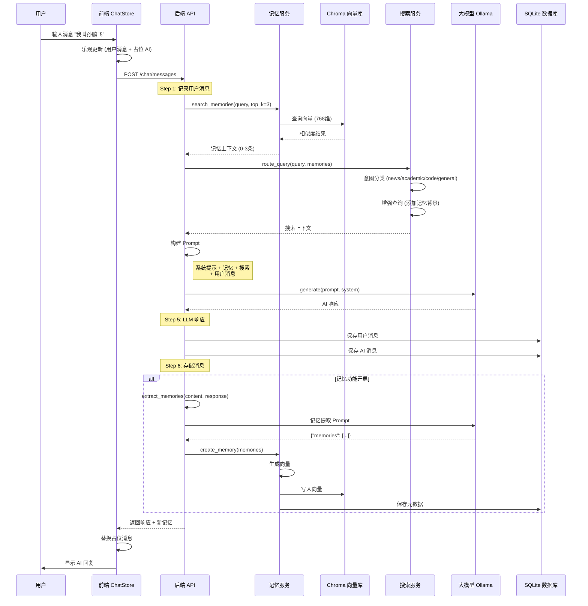

# SunChat 对话流程图



## 关键步骤详解

### Step 1: 用户消息处理
```
日志: [CHAT] Step 1/6: 处理用户消息
```

### Step 2: 记忆上下文构建
```
输入: query="我叫孙鹏飞", top_k=3
处理: search_memories → Chroma 检索
输出: memory_context = [{"content": "...", "similarity": 0.85, ...}]
日志: [CHAT] Step 2/6: 构建记忆上下文 - 上下文数:1
```

### Step 3: 搜索上下文构建
```
输入: query="我叫孙鹏飞", memories=[...]
处理: route_query → 意图分类 + 查询增强
输出: search_context = {"intent": "general", "query": "..."}
日志: [CHAT] Step 3/6: 搜索上下文 - intent:general
```

### Step 4: Prompt 构建
```
系统提示: 你是一个智能助手。请回答用户问题。

用户背景信息（基于语义检索的记忆）：
- 用户喜欢 Python (相似度: 0.85)
- 用户熟悉 Vue (相似度: 0.72)

搜索上下文：用户查询 (用户背景: ...)
用户: 我叫孙鹏飞

AI:
```

### Step 5: LLM 调用
```
模型: qwen3-coder-next:q8_0
输入: 完整 prompt
输出: "好的，孙鹏飞，记住了！😊 有什么我可以帮您的？"
日志: [CHAT] Step 5/6: 调用 LLM 生成响应
```

### Step 6: 消息存储
```
存储:
- user_msg: {"role": "user", "content": "我叫孙鹏飞"}
- ai_msg: {"role": "assistant", "content": "好的，孙鹏飞..."}
日志: [CHAT] 用户消息已存储, [CHAT] AI 消息已存储
```

### Step 7: 记忆提取 (可选)
```
输入: user_message="我叫孙鹏飞", ai_response="好的，孙鹏飞..."
Prompt: 从对话中提取记忆
LLM 输出: {"memories": [{"content": "用户叫孙鹏飞", "importance": 10}]}
处理: create_memory → 生成向量 → Chroma 写入 → SQLite 写入
日志: [CHAT] 记忆提取完成 - 提取到 1 条记忆
```
